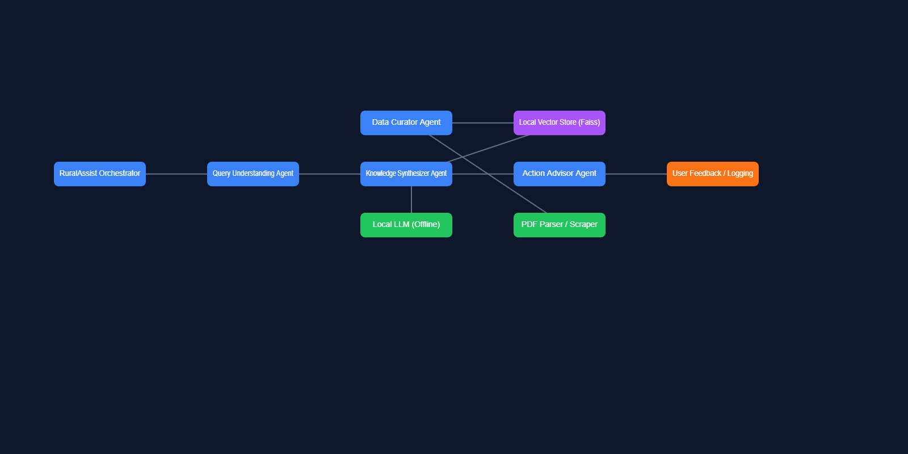

# 🌾 RuralAssist: Offline Multi-Agent Intelligence for Low-Resource Communities


An **Agents for Good** Capstone Project — delivering *trusted, offline, zero-cost* health and farming guidance using a **multi-agent Offline RAG architecture** powered entirely by free, open-source tools.

RuralAssist is a **multi-agent offline intelligence system** designed to combat misinformation and knowledge gaps in rural communities. By combining structured agents with a local **FAISS vector store**, RuralAssist provides reliable and verified guidance on health, agriculture, and essential services — completely offline and at zero recurring cost.

---

## 🌱 Problem

Rural areas face:

- ❌ Poor or no internet connectivity
- ❌ High spread of misinformation
- ❌ Limited access to experts
- ❌ Dependency on cloud tools that require API keys or billing

This leads to unsafe remedies, crop loss, and reduced community productivity.

**RuralAssist solves this by operating fully offline with zero cloud dependency.**

---

## 🧠 Solution Overview

RuralAssist uses a **Multi-Agent System** to process user questions through structured, specialized agents:

- **🗂 Data Curator Agent** — Extracts text from PDFs, chunks it, embeds it, and builds a local FAISS vector store
- **🧩 Query Understanding Agent** — Cleans the query, classifies intent, and detects out-of-domain questions
- **🔍 Knowledge Synthesizer Agent** — Retrieves the top evidence chunks using FAISS + embeddings
- **💡 Action Advisor Agent** — Generates safe, structured, verified step-by-step guidance

Everything runs **fully offline** — making it ideal for underserved rural communities.

---

## 🧩 Key Features

- 🌀 **Multi-Agent Architecture** (4 specialized agents)
- 💾 **Offline RAG Pipeline** (FAISS + Sentence Transformers)
- 📄 **PDF Parsing** (pdfminer.six, BeautifulSoup)
- 🧭 **Zero API Keys — Zero Billing — 100% Open Source**
- 🔐 **Private, Local, Offline Execution**
- 🌾 **Optimized for agriculture & basic health guidance**
- 🚫 **Automatic Out-of-Domain Detection** (Safe Fallback)

---

## 🧠 Architecture Diagram

<p align="center">
  
</p>

---

## 🚀 How to Run RuralAssist 

This guide shows how to set up and run the full offline multi-agent system on any computer.

### 1️⃣ Clone the Repository

```bash
git clone https://github.com/21N81A66K0/ruralassist.git
cd ruralassist
```

### 2️⃣ Install Dependencies

```bash
pip install -r requirements.txt
```

All packages are 100% free and support offline execution.

### 3️⃣ Add Knowledge PDFs

Place your PDF files inside:

```
data/raw/
```

**Examples:**
- Crop disease guides
- Government agriculture manuals
- Health safety leaflets

### 4️⃣ Build the Offline Vector Database (FAISS)

This prepares the entire knowledge base for offline retrieval.

```bash
python agents/curator.py
```

**If successful, you will see:**

- `data/vector_store/faiss.index`
- `data/vector_store/chunks.txt`

### 5️⃣ Run the Full Multi-Agent System

```bash
python app/orchestrator.py
```

**Example inputs:**
```
My maize leaves are turning yellow.
How to treat dehydration safely?
What fertilizer should I use for tomatoes?
```

**You will receive:**

- ✔ **Category** (agriculture / health / out-of-domain)
- ✔ **Evidence summary** (from real PDFs)
- ✔ **Safe & verified step-by-step guidance**


